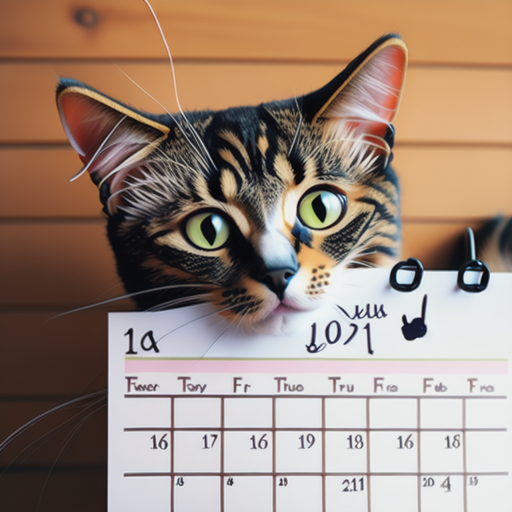

# Catlendar 🐱

_An interactive web-based calendar with a fun twist! Not only can you save tasks for specific dates, but each day greets you with a random cat picture and a fascinating cat fact._

## Table of Contents

- [Overview](#overview)
- [Motivation](#cats-and-humor)
- [Supporting Researches](#researches)
- [Features](#features)
- [Getting Started](#getting-started)
- [Usage](#usage)
- [Tech Stack](#tech-stack)
- [Deployment](#deployment)
- [Demo](#demo)
- [Contribute](#contribute)
- [License](#license)
- [Credits](#license)
- [Contact](#contact)

## Overview 📖

Catlendar is a fusion of fun and functionality, harnessing the allure of cats and the benefits of humor to make task management a breeze. Never dread your to-do list again; Catlendar is here to make your day pawsitively purrfect!

## Cats and Humor 🐾

Modern life is a juggling act. Amidst the hustle, Catlendar offers a unique remedy. Here's why:

- **Stress Relief:** Humor and laughter are proven stress busters.
- **Engagement Boost:** A delightful user experience ensures higher engagement.
- **Enhanced Creativity:** A sprinkle of humor can supercharge your creativity.
- **Leadership Skills:** Humor fosters an aura of confidence and competence.

For all these reasons and more, _Catlendar_ is more than a task manager – it's your daily dose of joy!

## Researches 📚

1. [Having fun! The role of workplace fun in enhancing employees’ creative behaviors in Chinese work settings](https://www.ncbi.nlm.nih.gov/pmc/articles/PMC10040513/)
2. [Humor in Workplace Leadership: A Systematic Search Scoping Review](https://www.ncbi.nlm.nih.gov/pmc/articles/PMC8353333/)
3. [The Benefits of Laughing in the Office](https://hbr.org/2018/11/the-benefits-of-laughing-in-the-office)

## Features 🌟

- Save tasks for specific dates.
- Edit or delete tasks.
- Get greeted with a random cat picture every day.
- Learn a new cat fact daily.
- Switch between Light and Dark themes.

## Getting Started 🚀

1. Clone the repository: `https://github.com/tdavids215/Catlender.git`

2. Open `index.html` in your browser.

3. Let the cats guide you through your tasks.

## Usage 📋

1. Open the `index.html` in a browser.
2. Choose a date to save a task or view saved tasks.
3. Enter your task in the textarea and hit "Submit".
4. Each task has an "Edit" and "Delete" button.
5. Switch between Light and Dark themes using the "Dark Mode" checkbox.

## Tech Stack 💻

- **Frontend:**   
- **Cat Picture:** [TheCatAPI](https://thecatapi.com/)
- **Cat Facts:** [Meow Facts](https://rapidapi.com/wh-iterabb-it-wh-iterabb-it-default/api/meowfacts)
- **PicoCSS:** [PicoCSS](https://picocss.com/)

## Deployment 🌎

[The clawsome Catlendar, Moew ≽^•⩊•^≼](https://tdavids215.github.io/Catlender/)

## Demo 🎬

## Contribute 🤝

Your ideas can make Catlendar even more clawsome! Fork the repo, make your changes, and submit a pull request.

## License 🧾

This project is licensed under the MIT License.

## Credits ✋

- [Tessa Davidson](https://github.com/tdavids215) - Developer
- [James Peltier](https://github.com/trackstarr) - Developer
- [Arsalan Bardsiri](https://github.com/arsalanbardsiri/) - Developer

## Contact 🌐

- Tessa Davidson - [tdavids215@gmail.com](mailto:tdavids215@gmail.com)
- James Peltier - [peltierjames@gmail.com](mailto:peltierjames@gmail.com)
- Arsalan Bardsiri - [arsalanbardsiri@gmail.com](mailto:arsalanbardsiri@gmail.com)

                            ╱|、
                          (˚ˎ 。7  
                           |、˜〵          
                          じしˍ,)ノ